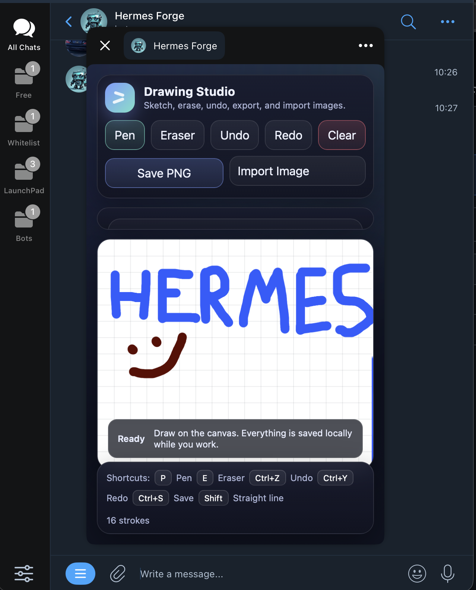
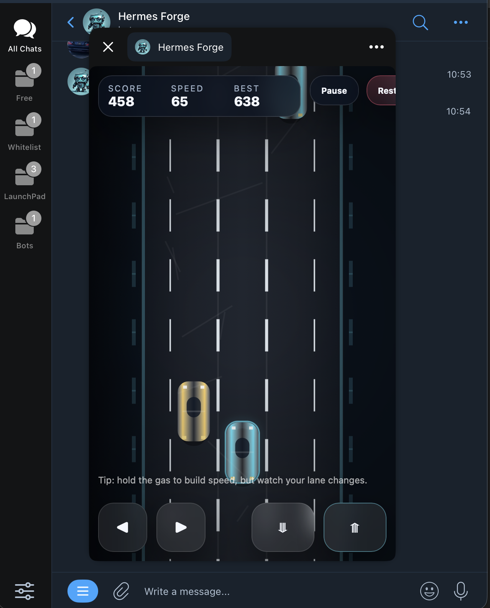
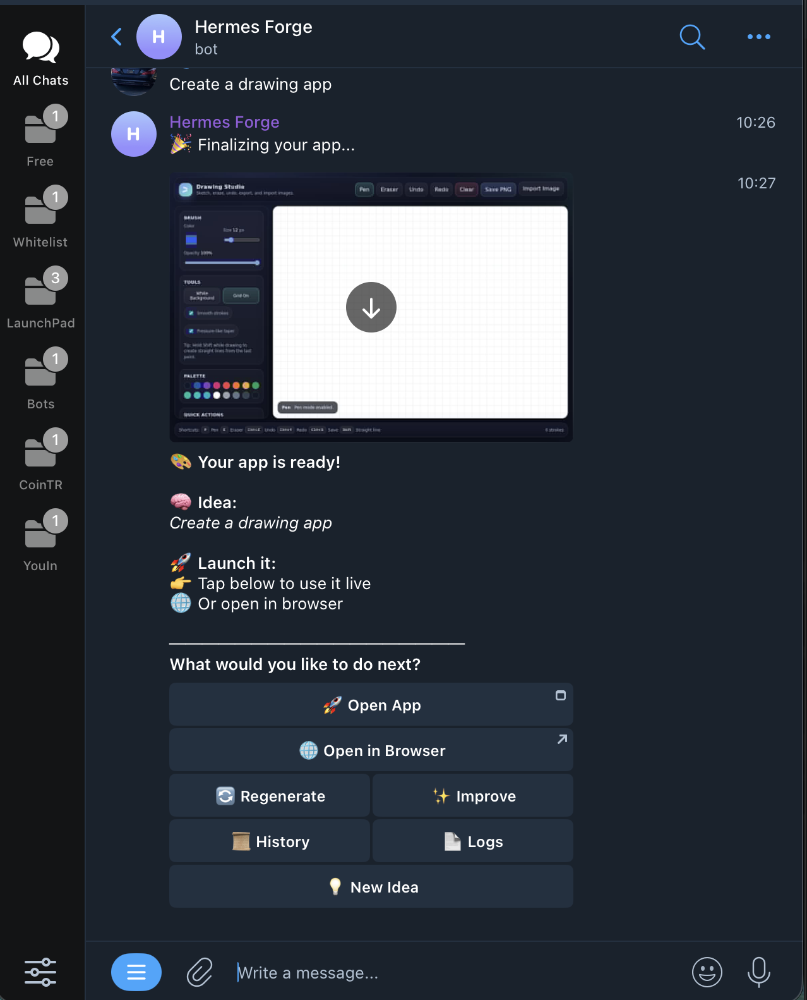

# 🚀 Hermes Forge

**Turn ideas into live apps instantly.**

Hermes Forge is an AI-powered system that generates fully interactive web apps from simple prompts, and delivers them directly inside Telegram or Hermes.

---

## 📸 Screenshots

### 🎨 Drawing App

### 🏎 Racing Game

### 🤖 Telegram UI

---

## ✨ Features

- 🧠 Prompt → App generation  
- 🌐 Live app hosting (via HTTP + Cloudflare tunnel)  
- 📱 Telegram WebApp integration (interactive, not screenshots)  
- 🔁 Regenerate / Improve flows  
- 📜 Prompt history tracking  
- 🧩 Platform-agnostic (works in Telegram + Hermes)  

---

## 🏗 Architecture

### Core Engine (Hermes)
- Generates apps from prompts  
- Handles logic + iteration  

### Deployment Layer
- Local HTTP server  
- Cloudflare tunnel (HTTPS exposure)  

### Interface Layer
- Telegram Bot (WebApp button)  
- Hermes integration  

---

## 📸 Demo

- Generate an app from a prompt  
- Instantly open it inside Telegram  
- Fully interactive (not static screenshots)  

---

## ⚙️ Setup

### 1. Clone

    git clone https://github.com/JackTheGit/hermes-forge.git
    cd hermes-forge

---

### 2. Create virtual environment

    python3 -m venv venv
    source venv/bin/activate

---

### 3. Install dependencies

    pip install python-telegram-bot playwright
    python -m playwright install

---

### 4. Run everything

    chmod +x run_all.sh
    ./run_all.sh

This will:

- Start HTTP server  
- Start Cloudflare tunnel  
- Inject HTTPS URL into bot  
- Launch Telegram bot  

---

## 🔐 Requirements

- Python 3.10+  
- Telegram Bot Token  
- cloudflared binary (auto-downloaded if missing)  

---

## 📲 Telegram WebApp

Apps are opened using:

    InlineKeyboardButton(
        "🚀 Open App",
        web_app=WebAppInfo(url=APP_URL)
    )

This enables **native interactive apps inside Telegram**.

---

## 🧠 Example Prompts

- "Create a drawing app"  
- "Build a racing game"  
- "Make a todo list with dark mode"  

---

## 🚧 Roadmap

- Persistent hosting (no temporary tunnels)  
- Multi-user sessions  
- App export / share  
- Auth + storage  

---

## 👨‍💻 Author

Built by ISODL
