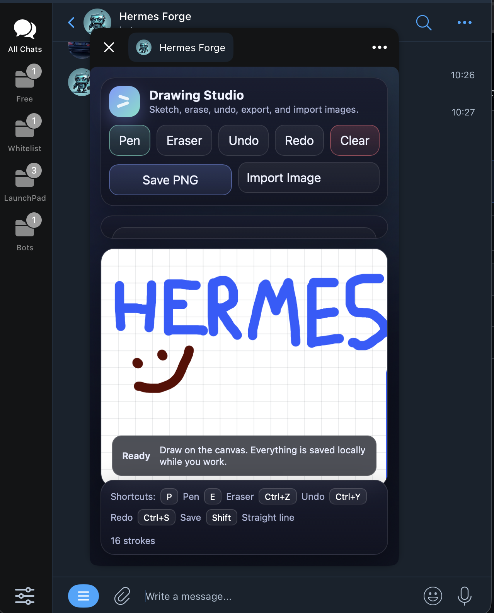
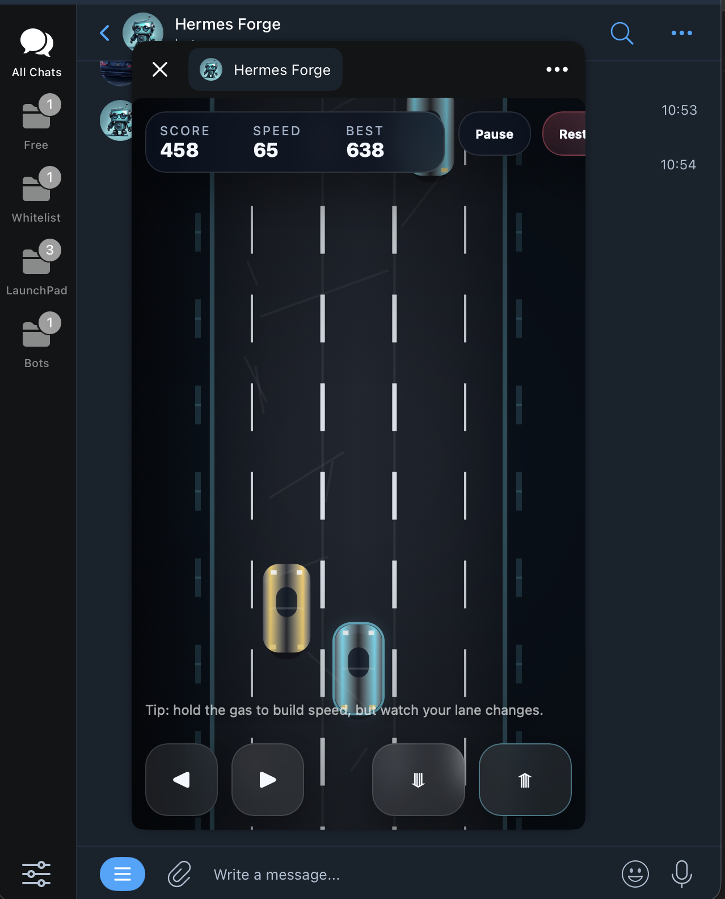
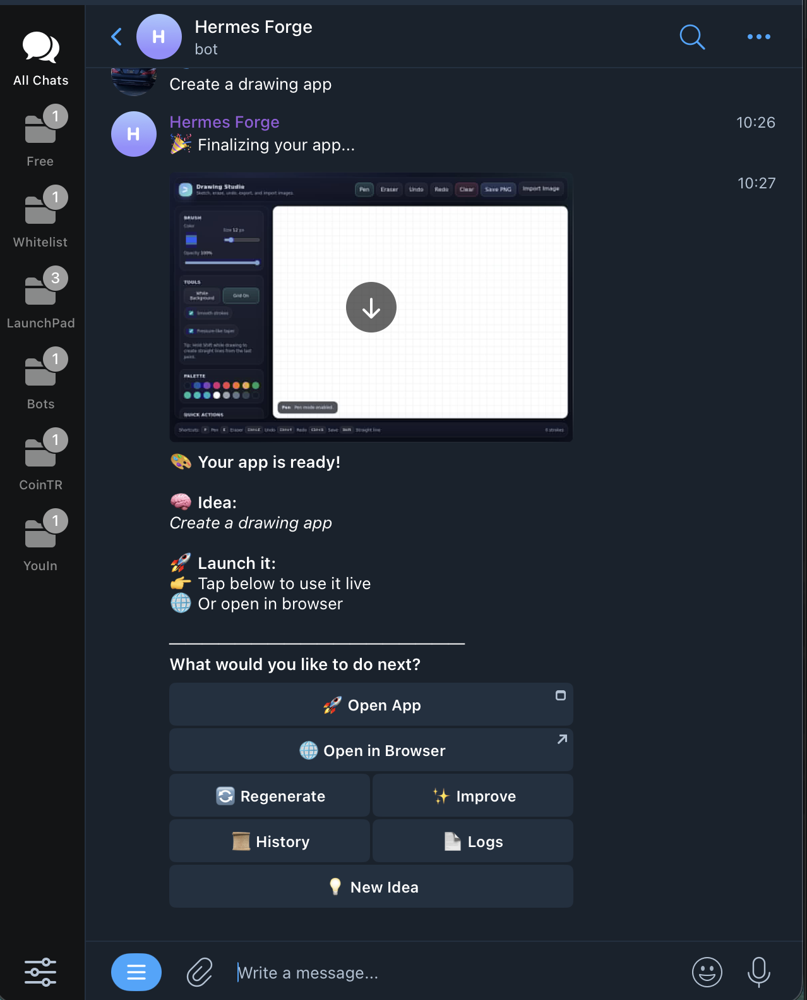

# 🚀 Hermes Forge


**Turn ideas into live apps instantly — inside Telegram.**

Hermes Forge is an AI-powered system that generates fully interactive web apps from simple prompts, hosts them live, and delivers them directly inside Telegram with one tap.

---

## 📸 Screenshots

### 🎨 Drawing App


### 🏎 Racing Game


### 🤖 Telegram UI


---

## ✨ Features

- 🧠 Prompt → Full app generation  
- ⚡ Real-time build progress (Planning → Building → Packaging)  
- 🌐 Live hosting via HTTP + Cloudflare tunnel  
- 📱 Telegram WebApp integration (fully interactive apps)  
- 🔁 Regenerate apps instantly  
- ✨ Improve apps with follow-up prompts  
- ⚡ Auto Improve (v1 → v5 iterative enhancement)  
- 📸 Automatic app preview screenshots  
- 📜 Prompt history tracking  
- 📄 Build logs viewer  
- 🧩 Works inside Telegram + Hermes  

---

## 🏗 Architecture

### 🧠 Core Engine (Hermes Forge)
- Generates apps from prompts  
- Handles retries + improvements  
- Outputs versioned HTML apps  

### 🌐 Deployment Layer
- Local HTTP server (`python -m http.server`)  
- Cloudflare Tunnel (public HTTPS URL)  

### 📱 Interface Layer
- Telegram Bot UI  
- Inline buttons + WebApp launcher  
- Live progress + preview system  

---

## ⚡ Flow

1. User sends prompt in Telegram  
2. Hermes Forge generates app  
3. Output HTML is saved in `/outputs`  
4. App is exposed via Cloudflare URL  
5. Telegram shows:
   - 📸 Preview screenshot  
   - 🚀 Open App button (WebApp)  
   - 🌐 Open in browser  
   - 🔁 Regenerate / Improve / Auto Improve  

---

## 📸 Demo

- Send: `Create a drawing app`  
- Watch live progress updates  
- Get instant preview + launch button  
- Open and interact directly inside Telegram  

---

## ⚙️ Setup

### 1. Clone

```

git clone [https://github.com/JackTheGit/hermes-forge.git](https://github.com/JackTheGit/hermes-forge.git)
cd hermes-forge

```

---

### 2. Create virtual environment

```

python3 -m venv venv
source venv/bin/activate

```

---

### 3. Install dependencies

```

pip install python-telegram-bot playwright requests python-dotenv
python -m playwright install chromium

```

---

### 4. Add environment variables

Create `.env` file:

```

TELEGRAM_TOKEN=your_bot_token_here

```

---

### 5. Run everything

```

chmod +x run_all.sh
./run_all.sh

```

This automatically:

- 🌐 Starts HTTP server  
- 🔐 Starts Cloudflare tunnel  
- ✏️ Injects tunnel URL into bot  
- 🤖 Launches Telegram bot  

---

## 🔐 Requirements

- Python 3.10+  
- Telegram Bot Token  
- Linux / VPS recommended  
- `cloudflared` (auto-downloaded)  

---

## 📱 Telegram WebApp

Apps are opened natively inside Telegram:

```

InlineKeyboardButton(
"🚀 Open App",
web_app=WebAppInfo(url=APP_URL)
)

```

This enables:

- Full interactivity  
- No redirects  
- App-like experience  

---

## 🧠 Example Prompts

- "Create a drawing app"  
- "Build a racing game"  
- "Make a todo list with dark mode"  
- "Create a multiplayer pong game"  
- "Build a finance dashboard"  

---

## ⚡ Advanced Features

### ✨ Improve Mode
Refine your app with natural language:
> "Add undo button and color picker"

---

### ⚡ Auto Improve (v1 → v5)
Runs multiple improvement passes automatically:

- v1 → Base app  
- v2–v5 → Progressive enhancements  
- Better UI, UX, features  

---

### 📸 Preview System
- Automatically screenshots generated apps  
- Sends preview inside Telegram  
- Uses Playwright (headless Chromium)  

---

## 🚧 Roadmap

- Persistent hosting (no temporary tunnels)  
- Multi-user isolation  
- App sharing links  
- Version history per app  
- Authentication + storage  
- Mobile-native UI improvements  

---

## 👨‍💻 Author

Built by **ISODL**

---

## ⭐ Contributing

PRs welcome. Ideas welcome. Chaos welcome.

---

## ⚠️ Disclaimer

- Cloudflare tunnels are temporary  
- Apps are stateless (for now)  
- Use responsibly  

---

## 🧠 Vision

Hermes Forge is evolving into:

> **“Prompt → Software” as a real-time system**

No setup. No coding. Just ideas → working apps.

---
